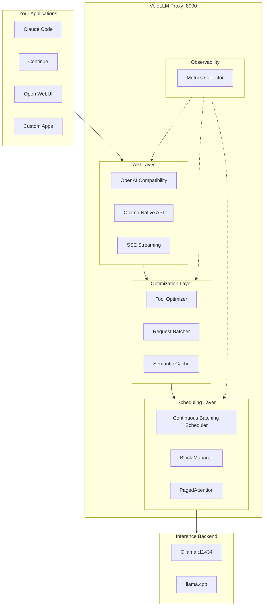
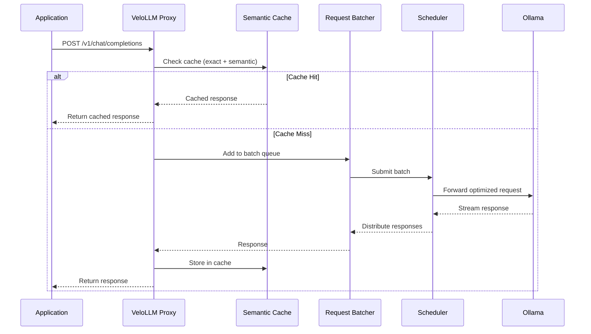
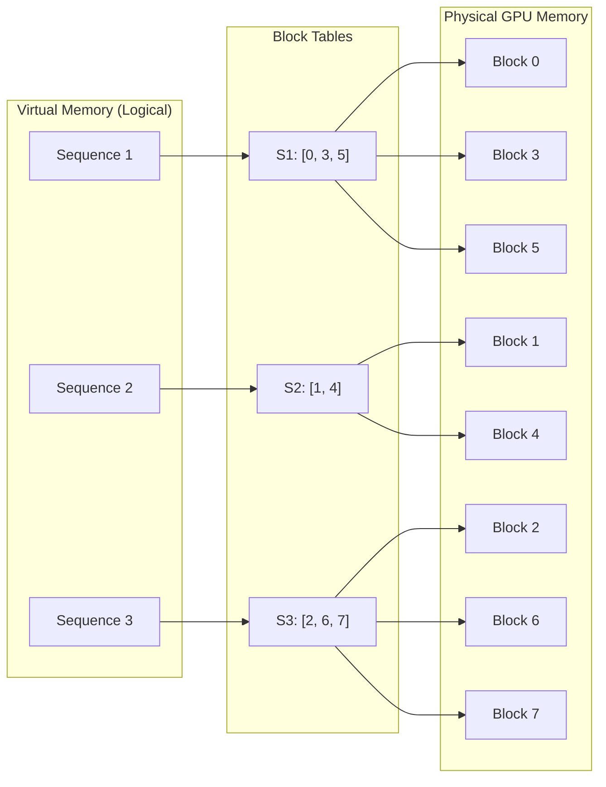
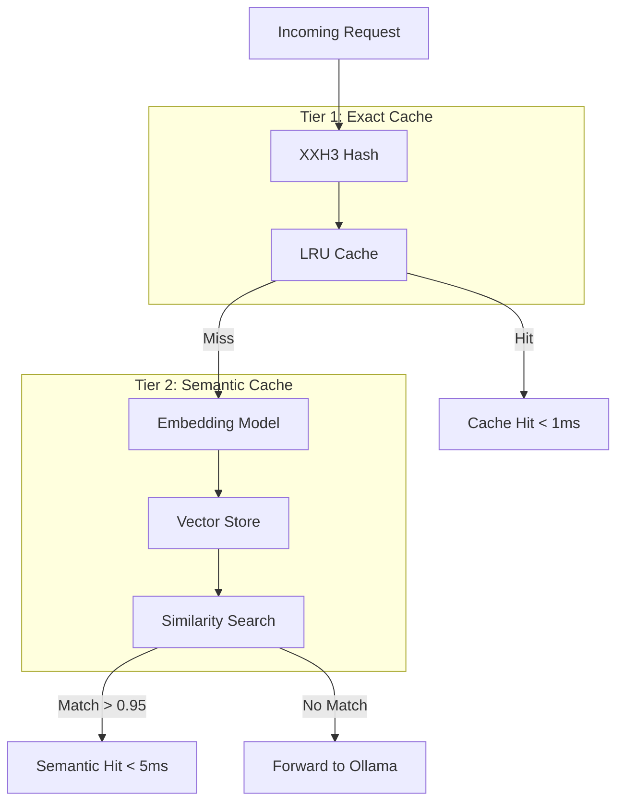
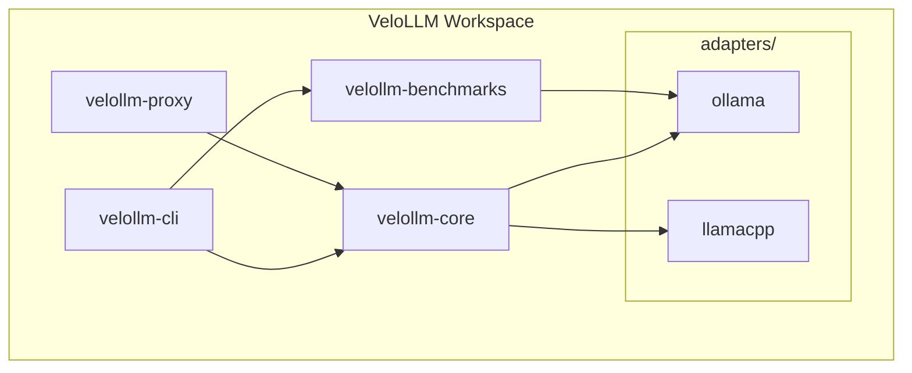
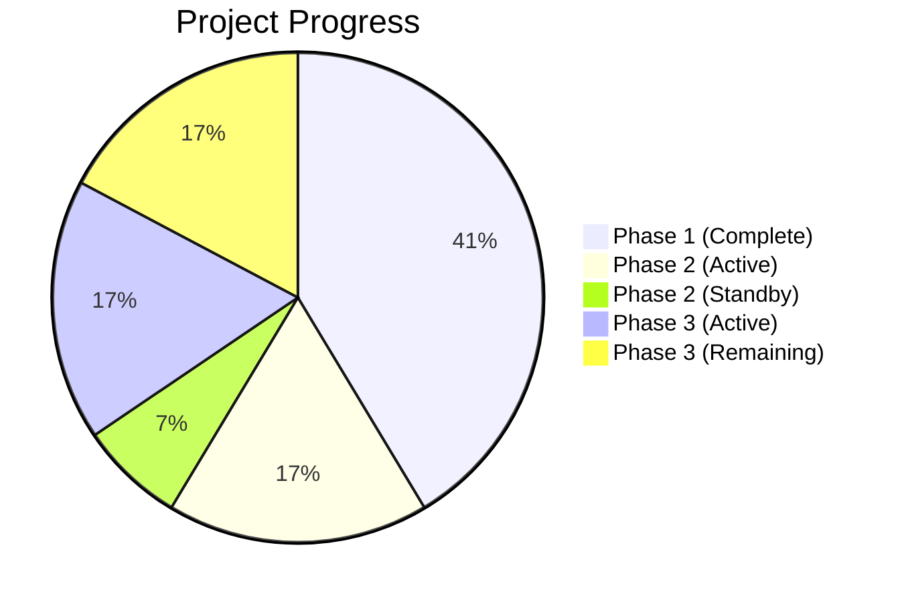
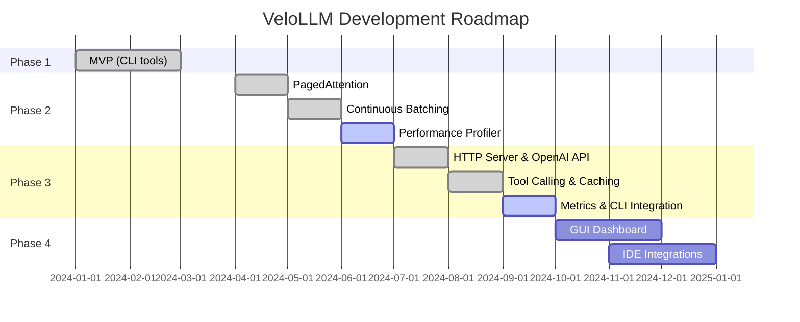

# VeloLLM

**Autopilot for Local LLM Inference** - High-performance proxy and optimization toolkit for Ollama and llama.cpp.

[](https://opensource.org/licenses/MIT)
[](https://www.rust-lang.org/)
[](https://github.com/ArthurDEV44/velollm/actions/workflows/ci.yml)

---

## The Problem

Local LLM inference is **19x slower** than production solutions like vLLM. VeloLLM bridges this gap by providing a high-performance Rust proxy that optimizes requests, improves tool calling reliability, and brings production-grade features to local deployments.

| Metric | Production (vLLM) | Local (Ollama) | Gap |
|--------|-------------------|----------------|-----|
| Throughput | 793 tokens/s | 41 tokens/s | 19x |
| P99 Latency | 80ms | 673ms | 8x |

**VeloLLM Goal**: Bring vLLM-level performance to Ollama users while keeping the simplicity.

---

## What is VeloLLM?

VeloLLM is a **transparent proxy** that sits between your applications and Ollama. It intercepts API calls, applies intelligent optimizations, and forwards them to Ollama. Your existing tools work without modification - just change the API endpoint.

### Key Benefits

- **Drop-in replacement**: Full OpenAI API compatibility
- **Tool calling improvements**: JSON fixing, deduplication, schema validation
- **Performance optimization**: Request batching, intelligent caching, continuous scheduling
- **Metrics & observability**: Track tokens/s, latency, cache hit rates
- **Advanced memory management**: PagedAttention for efficient KV cache

### Supported Models for Tool Calling

- Mistral (mistral:7b, mistral-small:24b)
- Llama (llama3.2:3b, llama3.1:8b, llama3.1:70b)

---

## Architecture



### Request Flow



---

## Features

### Implemented

#### Phase 1: MVP (Complete)

| Feature | Description |
|---------|-------------|
| **Hardware Detection** | Auto-detect GPU (NVIDIA, AMD, Apple Silicon, Intel), CPU, and memory |
| **Benchmarking Suite** | Measure tokens/s, TTFT, total latency with multiple profiles |
| **Ollama Auto-Configuration** | Generate optimized environment variables based on hardware |
| **Speculative Decoding Analysis** | Research and parameter recommendations for draft models |

#### Phase 2: Advanced Optimizations (83% Complete)

| Feature | Description |
|---------|-------------|
| **PagedAttention Block Manager** | Memory-efficient KV cache with 16-token blocks, reference counting, and CoW |
| **llama.cpp KV Cache Integration** | Paged cache wrapper compatible with llama_memory_* API |
| **CUDA Paged Attention Kernel** | GPU-accelerated attention with FP16/FP32 and GQA support |
| **Continuous Batching Scheduler** | Dynamic request scheduling with priority and preemption |

#### Phase 3: Intelligent Proxy (50% Complete)

| Feature | Description |
|---------|-------------|
| **HTTP Server** | Axum-based server with Tower middleware |
| **OpenAI API Compatibility** | Full support for `/v1/chat/completions`, `/v1/models` |
| **Tool Calling Enhancement** | Automatic JSON fixing, deduplication, schema validation |
| **Request Batching** | Group concurrent requests, priority-based scheduling |
| **Semantic Cache** | Embedding-based similarity matching, exact + semantic caching |

### Coming Soon

| Feature | Status |
|---------|--------|
| Metrics & Observability | Planned |
| CLI Integration (`velollm serve`) | Planned |
| Prompt Compression | Planned |
| Speculative Prefetch | Planned |
| Multi-Model Load Balancing | Planned |

---

## Memory Management: PagedAttention

VeloLLM implements PagedAttention for efficient KV cache management, inspired by vLLM.



**Benefits**:
- **70% reduction** in memory fragmentation
- **Dynamic allocation**: Sequences grow without pre-allocation
- **Memory sharing**: Copy-on-Write for beam search and parallel sampling
- **Efficient preemption**: Swap sequences without losing context

---

## Tool Calling Optimization

VeloLLM fixes common tool calling issues that occur with local models.

```mermaid
flowchart LR
    subgraph Input["Model Response"]
        RAW["```json
{name: 'get_weather',
 args: {city: 'Paris',}}
```"]
    end

    subgraph Processing["Tool Optimizer"]
        FIX[JSON Fixer]
        VAL[Schema Validator]
        DED[Deduplicator]
    end

    subgraph Output["Clean Tool Call"]
        CLEAN["{
  \"name\": \"get_weather\",
  \"arguments\": {
    \"city\": \"Paris\"
  }
}"]
    end

    RAW --> FIX
    FIX --> VAL
    VAL --> DED
    DED --> CLEAN
```

**Fixes applied**:
- Remove markdown code blocks
- Fix trailing commas
- Quote unquoted keys
- Extract JSON from mixed content
- Validate against function schemas
- Deduplicate repeated tool calls

---

## Caching System

VeloLLM implements a two-tier caching system for optimal performance.



**Performance targets**:
- Exact cache hit: < 1ms latency
- Semantic cache hit: < 5ms latency
- Cache hit rate: > 30% on repetitive workloads

---

## Project Structure



| Crate | Description |
|-------|-------------|
| `velollm-core` | Core library: hardware detection, PagedAttention, scheduler |
| `velollm-cli` | CLI binary: detect, benchmark, optimize commands |
| `velollm-proxy` | Proxy server: OpenAI compatibility, optimizations |
| `velollm-benchmarks` | Benchmarking library for Ollama |
| `adapters/ollama` | Ollama configuration parser and optimizer |
| `adapters/llamacpp` | llama.cpp integration, CUDA kernels |

---

## Development Status

### Progress by Phase



| Phase | Status | Progress |
|-------|--------|----------|
| Phase 1: MVP | Complete | 12/12 (100%) |
| Phase 2: Advanced Optimizations | In Progress | 5/6 active (83%) |
| Phase 3: Intelligent Proxy | In Progress | 5/10 (50%) |

### Test Coverage

| Crate | Tests |
|-------|-------|
| velollm-core | 63 |
| velollm-benchmarks | 3 |
| velollm-adapters-llamacpp | 29 |
| velollm-adapters-ollama | 6 |
| velollm-cli (integration) | 8 |
| Doc tests | 8 |
| **Total** | **117** |

---

## Comparison

| Feature | Ollama | vLLM | LM Studio | VeloLLM |
|---------|--------|------|-----------|---------|
| Target Use Case | Simplicity | Cloud production | Desktop GUI | Local performance |
| OpenAI API Compat | Partial | Full | Partial | Full |
| Tool Calling Fix | No | N/A | No | Yes |
| PagedAttention | No | Yes | No | Yes (local) |
| Request Batching | No | Yes | No | Yes |
| Semantic Cache | No | No | No | Yes |
| Auto-optimization | No | No | Partial | Yes |
| Language | Go | Python | Electron | Rust |
| Open Source | Yes | Yes | No | Yes |

---

## Roadmap



**Phase 1** (Complete): MVP with CLI tools
- Hardware detection, benchmarking, Ollama configuration

**Phase 2** (83% Complete): Advanced optimizations
- PagedAttention, continuous batching scheduler, CUDA kernels

**Phase 3** (In Progress): Intelligent proxy
- OpenAI compatibility, tool calling enhancement, caching, metrics

**Phase 4** (Planned): Ecosystem
- GUI dashboard, IDE integrations, configuration marketplace

Full details: [ROADMAP.md](ROADMAP.md) | Task tracking: [TODO.md](TODO.md)

---

## Contributing

We welcome contributions! Areas of interest:

- **Performance**: Optimize the proxy, reduce latency
- **Tool Calling**: Improve JSON fixing, add more edge cases
- **Caching**: Enhance semantic cache with better embeddings
- **Testing**: Add integration tests, benchmark on diverse hardware
- **Documentation**: Improve guides and API docs

See [CONTRIBUTING.md](CONTRIBUTING.md) for guidelines.

---

## License

MIT License - see [LICENSE](LICENSE) for details.

---

## Links

- **Repository**: [github.com/ArthurDEV44/velollm](https://github.com/ArthurDEV44/velollm)
- **Issues**: [GitHub Issues](https://github.com/ArthurDEV44/velollm/issues)
- **Discussions**: [GitHub Discussions](https://github.com/ArthurDEV44/velollm/discussions)

---

**Status**: Phase 3 - Proxy development in progress (50% complete)

Built with Rust by the VeloLLM community.
