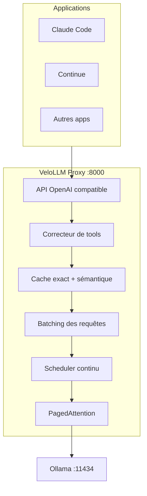

# VeloLLM

**Accélérateur pour l'inférence LLM locale** - Un proxy Rust haute performance pour Ollama et llama.cpp.

[](https://opensource.org/licenses/MIT)
[](https://www.rust-lang.org/)
[](https://github.com/ArthurDEV44/velollm/actions/workflows/ci.yml)

---

## C'est quoi VeloLLM ?

VeloLLM est un **proxy transparent** qui se place entre vos applications et Ollama pour accélérer l'inférence locale.

```
Votre application (Claude Code, Continue, etc.)
                    │
                    ▼
            VeloLLM Proxy (:8000)  ←── Optimisations automatiques
                    │
                    ▼
              Ollama (:11434)
```

**En pratique** : Vous changez juste l'URL de l'API (`localhost:8000` au lieu de `localhost:11434`) et VeloLLM s'occupe du reste.

---

## Pourquoi VeloLLM ?

L'inférence locale avec Ollama est **19x plus lente** que les solutions de production comme vLLM :

| Métrique | vLLM (cloud) | Ollama (local) | Écart |
|----------|--------------|----------------|-------|
| Débit | 793 tokens/s | 41 tokens/s | 19x |
| Latence P99 | 80ms | 673ms | 8x |

**L'objectif de VeloLLM** : Apporter les performances de vLLM aux utilisateurs d'Ollama, sans la complexité.

---

## Benchmarks

Tests réalisés sur un système avec RTX 4070 Ti SUPER + Ryzen 7800X3D.

### Latence par modèle

| Modèle | Direct Ollama | Via VeloLLM | Gain |
|--------|---------------|-------------|------|
| llama3.2:3b | 4.8s | 1.0s | **4.8x** |
| magistral:24b | 16.4s | 6.6s | **2.5x** |

### Routage multi-modèle automatique

Avec `model="auto"`, VeloLLM analyse la complexité et route vers le modèle optimal :

| Requête | Complexité | Modèle sélectionné |
|---------|------------|-------------------|
| "Hello" | 5% | llama3.2:3b (small) |
| "Explique un cache LRU" | 35% | mistral:7b (medium) |
| "Implémente Raft en Rust" | 42% | mistral:7b (medium) |
| "Architecture microservices complète" | 75% | magistral:24b (large) |

**Résultat** : Les requêtes simples sont traitées instantanément par un petit modèle, les requêtes complexes bénéficient d'un modèle plus puissant.

---

## Ce que fait VeloLLM

### 1. Corrige le tool calling

Les modèles locaux génèrent souvent du JSON mal formé. VeloLLM répare automatiquement :

```
Réponse du modèle                    Après VeloLLM
─────────────────                    ─────────────
```json                              {
{name: 'get_weather',        →         "name": "get_weather",
 args: {city: 'Paris',}}                "arguments": {"city": "Paris"}
```                                  }
```

- Supprime les blocs markdown
- Corrige les virgules en trop
- Ajoute les guillemets manquants
- Valide contre le schéma de la fonction
- Déduplique les appels répétés

### 2. Met en cache les réponses

VeloLLM utilise un cache à deux niveaux :

| Niveau | Fonctionnement | Latence |
|--------|----------------|---------|
| **Cache exact** | Hash de la requête (XXH3) | < 1ms |
| **Cache sémantique** | Similarité des embeddings | < 5ms |

Si vous posez une question similaire à une précédente, la réponse est instantanée.

### 3. Optimise la mémoire (PagedAttention)

Au lieu de pré-allouer toute la mémoire pour chaque requête, VeloLLM alloue par blocs de 16 tokens :

- **-70%** de fragmentation mémoire
- **+2x** de contexte possible avec la même RAM
- Partage de mémoire entre requêtes similaires (Copy-on-Write)

### 4. Groupe les requêtes (Batching)

Plusieurs requêtes simultanées ? VeloLLM les groupe intelligemment pour maximiser le débit GPU.

### 5. Compresse les prompts

- Déduplique les tokens répétés
- Cache les system prompts
- Résume les anciens messages

### 6. Prédit les prochaines requêtes

VeloLLM analyse les patterns d'utilisation et pré-génère les réponses probables.

### 7. Route vers le modèle optimal

Avec `model="auto"`, VeloLLM analyse la complexité de chaque requête et choisit automatiquement le meilleur modèle :

```
Requête entrante (model="auto")
         │
         ▼
┌─────────────────────┐
│ Analyse complexité  │  Facteurs :
│                     │  - Longueur du prompt
│  Score: 0.0 → 1.0   │  - Présence de tools
│                     │  - Type de tâche
└─────────┬───────────┘
          │
    ┌─────┼─────┐
    ▼     ▼     ▼
 Small  Medium  Large
 <30%   30-70%  >70%
```

---

## Installation

```bash
# Cloner le repo
git clone https://github.com/ArthurDEV44/velollm.git
cd velollm

# Compiler
cargo build --release

# Installer globalement (optionnel)
cargo install --path velollm-cli
```

---

## Utilisation

### Démarrer le proxy

```bash
# Démarrer Ollama
ollama serve &

# Démarrer VeloLLM
velollm serve
```

Le proxy écoute sur `http://localhost:8000`.

### Configurer vos applications

Changez simplement l'URL de l'API :

```python
# Python avec OpenAI SDK
from openai import OpenAI

client = OpenAI(
    base_url="http://localhost:8000/v1",  # VeloLLM au lieu d'Ollama
    api_key="not-needed"
)

response = client.chat.completions.create(
    model="llama3.2:3b",
    messages=[{"role": "user", "content": "Bonjour !"}]
)
```

```bash
# Ou avec curl
curl http://localhost:8000/v1/chat/completions \
  -H "Content-Type: application/json" \
  -d '{
    "model": "llama3.2:3b",
    "messages": [{"role": "user", "content": "Bonjour !"}]
  }'
```

### Autres commandes

```bash
# Détecter le hardware
velollm detect

# Lancer un benchmark
velollm benchmark --model llama3.2:3b

# Optimiser la config Ollama
velollm optimize --dry-run
```

---

## Architecture



---

## Structure du projet

| Crate | Description |
|-------|-------------|
| `velollm-cli` | CLI : commandes `detect`, `benchmark`, `optimize`, `serve` |
| `velollm-core` | Coeur : détection hardware, PagedAttention, scheduler |
| `velollm-proxy` | Proxy : API OpenAI, cache, batching, tool optimizer |
| `velollm-benchmarks` | Benchmarks pour Ollama |
| `adapters/ollama` | Configuration Ollama |
| `adapters/llamacpp` | Intégration llama.cpp et kernels CUDA |

---

## État du projet

| Phase | Description | Avancement |
|-------|-------------|------------|
| **Phase 1** | MVP (CLI detect/benchmark/optimize) | 100% |
| **Phase 2** | PagedAttention, Scheduler, CUDA | 83% |
| **Phase 3** | Proxy intelligent | 100% |
| **Phase 4** | GUI et intégrations IDE | À venir |

**Prochaine étape** : Phase 4 - GUI Dashboard et intégrations IDE

---

## Comparaison

| Fonctionnalité | Ollama | vLLM | VeloLLM |
|----------------|--------|------|---------|
| Cible | Simplicité | Production cloud | Performance locale |
| API OpenAI | Partielle | Complète | Complète |
| Correction tool calling | Non | N/A | Oui |
| PagedAttention | Non | Oui | Oui |
| Batching | Non | Oui | Oui |
| Cache sémantique | Non | Non | Oui |
| Auto-optimisation | Non | Non | Oui |
| Langage | Go | Python | Rust |

---

## Contribuer

Les contributions sont bienvenues ! Domaines d'intérêt :

- **Performance** : Optimiser le proxy, réduire la latence
- **Tool Calling** : Améliorer la correction JSON
- **Cache** : Améliorer le cache sémantique
- **Tests** : Ajouter des tests d'intégration
- **Documentation** : Améliorer les guides

---

## Licence

MIT - voir [LICENSE](LICENSE)

---

## Liens

- **Repository** : [github.com/ArthurDEV44/velollm](https://github.com/ArthurDEV44/velollm)
- **Issues** : [GitHub Issues](https://github.com/ArthurDEV44/velollm/issues)
- **Roadmap détaillée** : [ROADMAP.md](ROADMAP.md)
- **Tâches en cours** : [TODO.md](TODO.md)

---

Construit en Rust avec performance.
