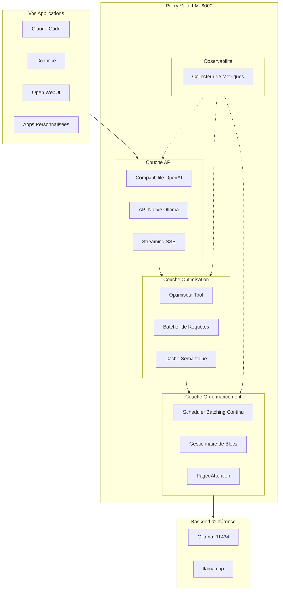
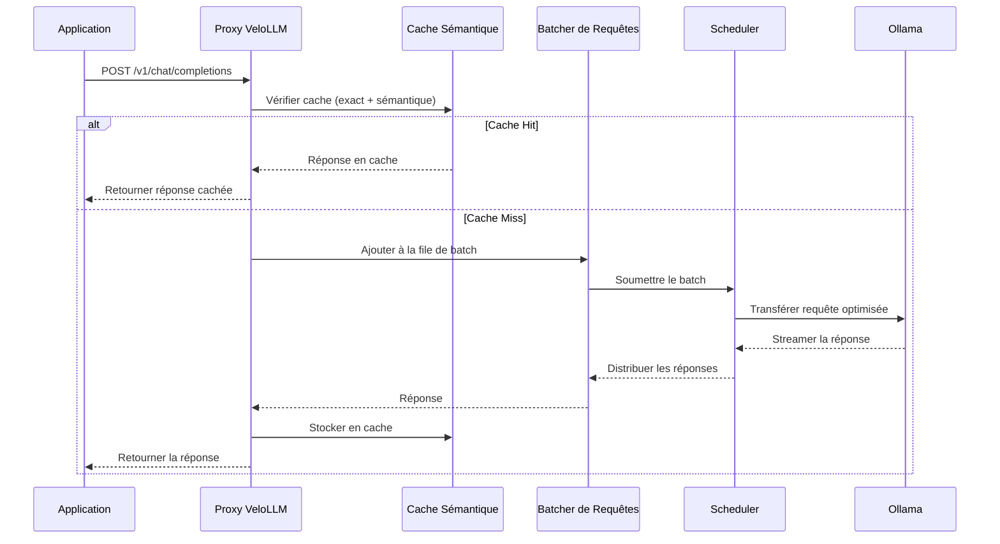
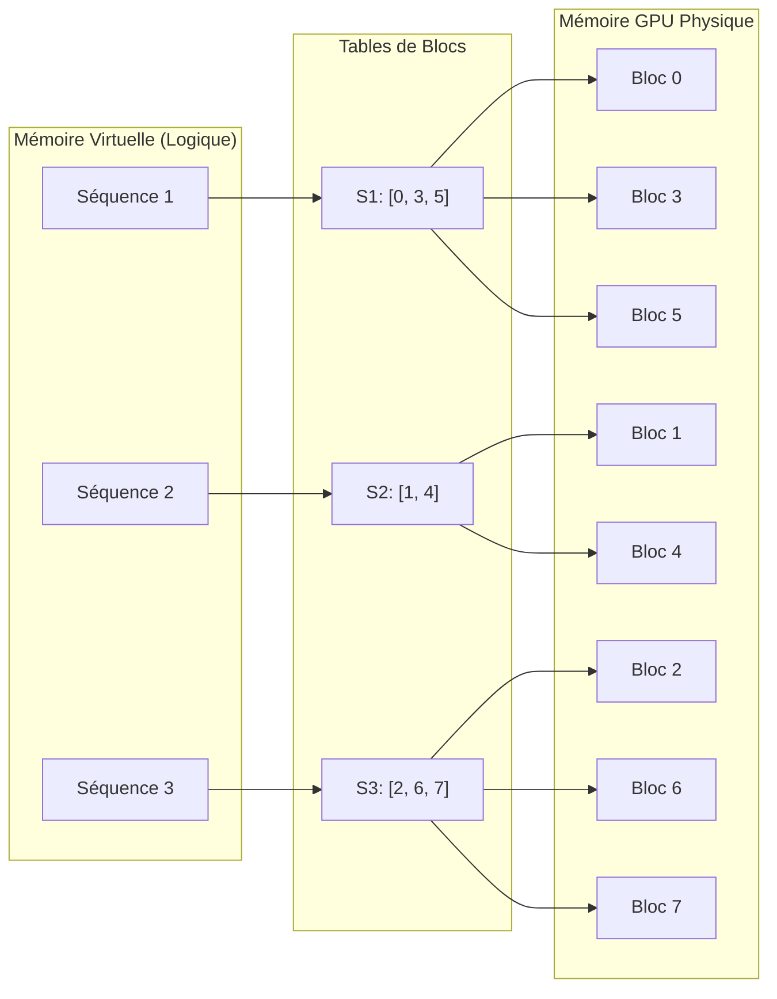
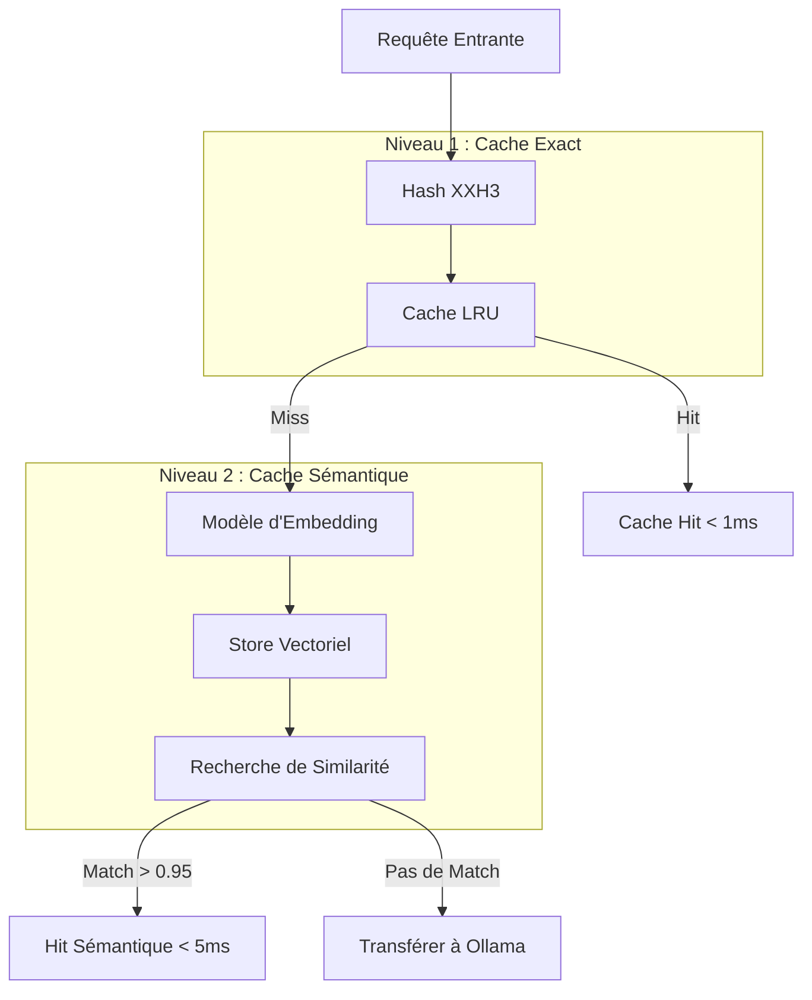
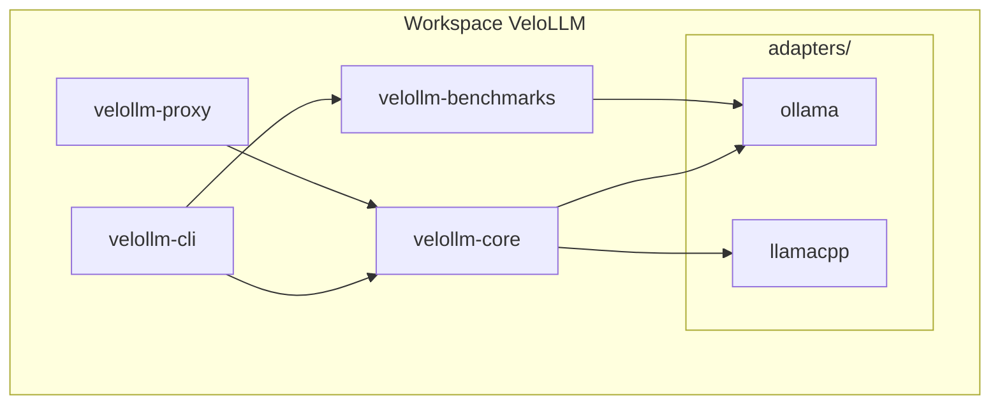
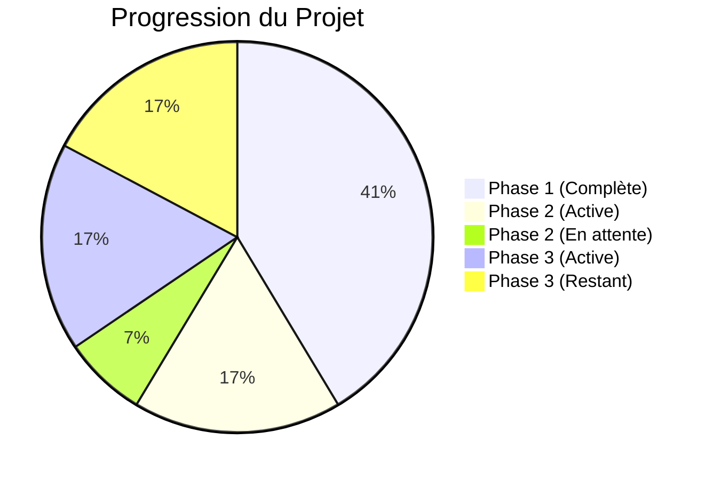
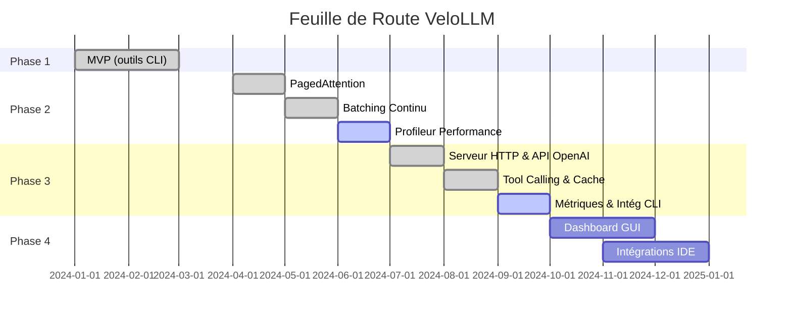

# VeloLLM

**Pilote automatique pour l'inférence LLM locale** - Proxy haute performance et boîte à outils d'optimisation pour Ollama et llama.cpp.

[](https://opensource.org/licenses/MIT)
[](https://www.rust-lang.org/)
[](https://github.com/ArthurDEV44/velollm/actions/workflows/ci.yml)

---

## Le Problème

L'inférence LLM locale est **19x plus lente** que les solutions de production comme vLLM. VeloLLM comble cet écart en fournissant un proxy Rust haute performance qui optimise les requêtes, améliore la fiabilité du tool-calling, et apporte des fonctionnalités de niveau production aux déploiements locaux.

| Métrique | Production (vLLM) | Local (Ollama) | Écart |
|----------|-------------------|----------------|-------|
| Débit | 793 tokens/s | 41 tokens/s | 19x |
| Latence P99 | 80ms | 673ms | 8x |

**Objectif VeloLLM** : Apporter les performances de vLLM aux utilisateurs d'Ollama tout en conservant la simplicité.

---

## Qu'est-ce que VeloLLM ?

VeloLLM est un **proxy transparent** qui se place entre vos applications et Ollama. Il intercepte les appels API, applique des optimisations intelligentes, et les transfère à Ollama. Vos outils existants fonctionnent sans modification - changez simplement l'endpoint API.

### Avantages Clés

- **Remplacement direct** : Compatibilité complète avec l'API OpenAI
- **Amélioration du tool-calling** : Correction JSON, déduplication, validation de schéma
- **Optimisation des performances** : Batching des requêtes, cache intelligent, ordonnancement continu
- **Métriques & observabilité** : Suivi des tokens/s, latence, taux de cache hit
- **Gestion avancée de la mémoire** : PagedAttention pour un cache KV efficace

### Modèles Supportés pour le Tool Calling

- Mistral (mistral:7b, mistral-small:24b)
- Llama (llama3.2:3b, llama3.1:8b, llama3.1:70b)

---

## Architecture



### Flux de Requête



---

## Fonctionnalités

### Implémentées

#### Phase 1 : MVP (Complète)

| Fonctionnalité | Description |
|----------------|-------------|
| **Détection Matérielle** | Détection auto GPU (NVIDIA, AMD, Apple Silicon, Intel), CPU et mémoire |
| **Suite de Benchmarks** | Mesure tokens/s, TTFT, latence totale avec plusieurs profils |
| **Auto-Configuration Ollama** | Génération de variables d'environnement optimisées selon le matériel |
| **Analyse Décodage Spéculatif** | Recherche et recommandations de paramètres pour modèles brouillons |

#### Phase 2 : Optimisations Avancées (83% Complète)

| Fonctionnalité | Description |
|----------------|-------------|
| **Gestionnaire de Blocs PagedAttention** | Cache KV efficace en mémoire avec blocs de 16 tokens, comptage de références et CoW |
| **Intégration Cache KV llama.cpp** | Wrapper de cache paginé compatible avec l'API llama_memory_* |
| **Kernel CUDA Paged Attention** | Attention accélérée GPU avec support FP16/FP32 et GQA |
| **Scheduler Batching Continu** | Ordonnancement dynamique des requêtes avec priorité et préemption |

#### Phase 3 : Proxy Intelligent (50% Complète)

| Fonctionnalité | Description |
|----------------|-------------|
| **Serveur HTTP** | Serveur basé sur Axum avec middleware Tower |
| **Compatibilité API OpenAI** | Support complet pour `/v1/chat/completions`, `/v1/models` |
| **Amélioration Tool Calling** | Correction JSON automatique, déduplication, validation de schéma |
| **Batching des Requêtes** | Groupement des requêtes concurrentes, ordonnancement par priorité |
| **Cache Sémantique** | Matching par similarité d'embeddings, cache exact + sémantique |

### À Venir

| Fonctionnalité | Statut |
|----------------|--------|
| Métriques & Observabilité | Planifié |
| Intégration CLI (`velollm serve`) | Planifié |
| Compression de Prompts | Planifié |
| Prefetch Spéculatif | Planifié |
| Équilibrage Multi-Modèles | Planifié |

---

## Gestion Mémoire : PagedAttention

VeloLLM implémente PagedAttention pour une gestion efficace du cache KV, inspiré de vLLM.



**Avantages** :
- **Réduction de 70%** de la fragmentation mémoire
- **Allocation dynamique** : Les séquences grandissent sans pré-allocation
- **Partage mémoire** : Copy-on-Write pour beam search et sampling parallèle
- **Préemption efficace** : Swap des séquences sans perdre le contexte

---

## Optimisation du Tool Calling

VeloLLM corrige les problèmes courants de tool calling qui surviennent avec les modèles locaux.

```mermaid
flowchart LR
    subgraph Input["Réponse du Modèle"]
        RAW["```json
{name: 'get_weather',
 args: {city: 'Paris',}}
```"]
    end

    subgraph Processing["Optimiseur Tool"]
        FIX[Correcteur JSON]
        VAL[Validateur de Schéma]
        DED[Dédupliqueur]
    end

    subgraph Output["Appel Tool Propre"]
        CLEAN["{
  \"name\": \"get_weather\",
  \"arguments\": {
    \"city\": \"Paris\"
  }
}"]
    end

    RAW --> FIX
    FIX --> VAL
    VAL --> DED
    DED --> CLEAN
```

**Corrections appliquées** :
- Suppression des blocs de code markdown
- Correction des virgules finales
- Quotation des clés non quotées
- Extraction du JSON depuis contenu mixte
- Validation contre les schémas de fonctions
- Déduplication des appels répétés

---

## Système de Cache

VeloLLM implémente un système de cache à deux niveaux pour des performances optimales.



**Objectifs de performance** :
- Cache hit exact : < 1ms de latence
- Cache hit sémantique : < 5ms de latence
- Taux de cache hit : > 30% sur workloads répétitifs

---

## Structure du Projet



| Crate | Description |
|-------|-------------|
| `velollm-core` | Bibliothèque core : détection matérielle, PagedAttention, scheduler |
| `velollm-cli` | Binaire CLI : commandes detect, benchmark, optimize |
| `velollm-proxy` | Serveur proxy : compatibilité OpenAI, optimisations |
| `velollm-benchmarks` | Bibliothèque de benchmarking pour Ollama |
| `adapters/ollama` | Parser et optimiseur de configuration Ollama |
| `adapters/llamacpp` | Intégration llama.cpp, kernels CUDA |

---

## Statut de Développement

### Progression par Phase



| Phase | Statut | Progression |
|-------|--------|-------------|
| Phase 1 : MVP | Complète | 12/12 (100%) |
| Phase 2 : Optimisations Avancées | En cours | 5/6 actives (83%) |
| Phase 3 : Proxy Intelligent | En cours | 5/10 (50%) |

### Couverture de Tests

| Crate | Tests |
|-------|-------|
| velollm-core | 63 |
| velollm-benchmarks | 3 |
| velollm-adapters-llamacpp | 29 |
| velollm-adapters-ollama | 6 |
| velollm-cli (intégration) | 8 |
| Doc tests | 8 |
| **Total** | **117** |

---

## Comparaison

| Fonctionnalité | Ollama | vLLM | LM Studio | VeloLLM |
|----------------|--------|------|-----------|---------|
| Cas d'usage cible | Simplicité | Production cloud | GUI desktop | Performance locale |
| Compat API OpenAI | Partielle | Complète | Partielle | Complète |
| Correction Tool Calling | Non | N/A | Non | Oui |
| PagedAttention | Non | Oui | Non | Oui (local) |
| Batching Requêtes | Non | Oui | Non | Oui |
| Cache Sémantique | Non | Non | Non | Oui |
| Auto-optimisation | Non | Non | Partielle | Oui |
| Langage | Go | Python | Electron | Rust |
| Open Source | Oui | Oui | Non | Oui |

---

## Feuille de Route



**Phase 1** (Complète) : MVP avec outils CLI
- Détection matérielle, benchmarking, configuration Ollama

**Phase 2** (83% Complète) : Optimisations avancées
- PagedAttention, scheduler de batching continu, kernels CUDA

**Phase 3** (En cours) : Proxy intelligent
- Compatibilité OpenAI, amélioration tool calling, cache, métriques

**Phase 4** (Planifiée) : Écosystème
- Dashboard GUI, intégrations IDE, marketplace de configurations

Détails complets : [ROADMAP.md](../../ROADMAP.md) | Suivi des tâches : [TODO.md](../../TODO.md)

---

## Contribution

Nous accueillons les contributions ! Domaines d'intérêt :

- **Performance** : Optimiser le proxy, réduire la latence
- **Tool Calling** : Améliorer la correction JSON, ajouter plus de cas limites
- **Cache** : Améliorer le cache sémantique avec de meilleurs embeddings
- **Tests** : Ajouter des tests d'intégration, benchmarker sur divers matériels
- **Documentation** : Améliorer les guides et la doc API

Voir [CONTRIBUTING.md](../../CONTRIBUTING.md) pour les directives.

---

## Licence

Licence MIT - voir [LICENSE](../../LICENSE) pour les détails.

---

## Liens

- **Dépôt** : [github.com/ArthurDEV44/velollm](https://github.com/ArthurDEV44/velollm)
- **Issues** : [GitHub Issues](https://github.com/ArthurDEV44/velollm/issues)
- **Discussions** : [GitHub Discussions](https://github.com/ArthurDEV44/velollm/discussions)

---

**Statut** : Phase 3 - Développement du proxy en cours (50% complète)

Construit avec Rust par la communauté VeloLLM.
